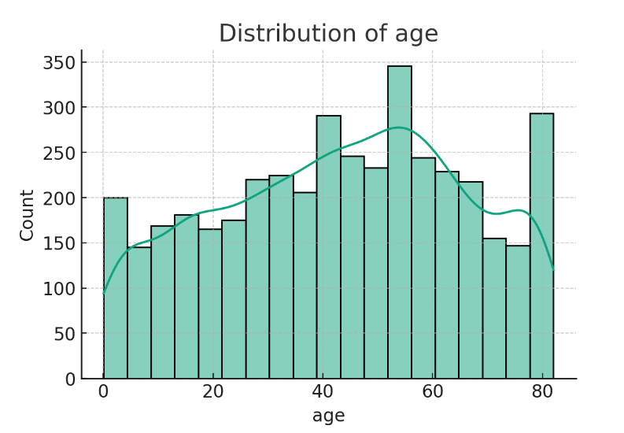
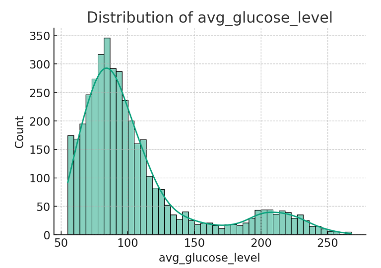
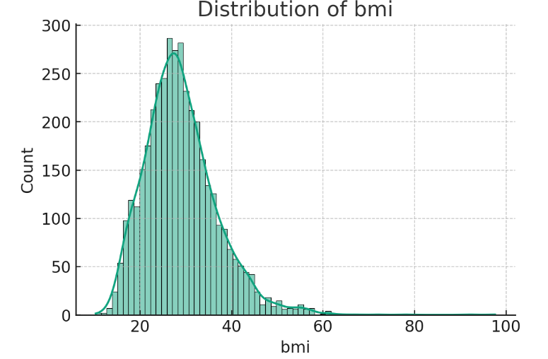
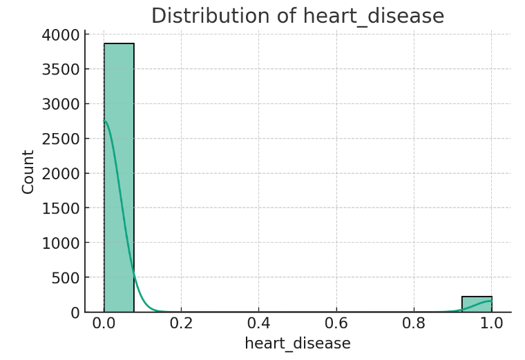
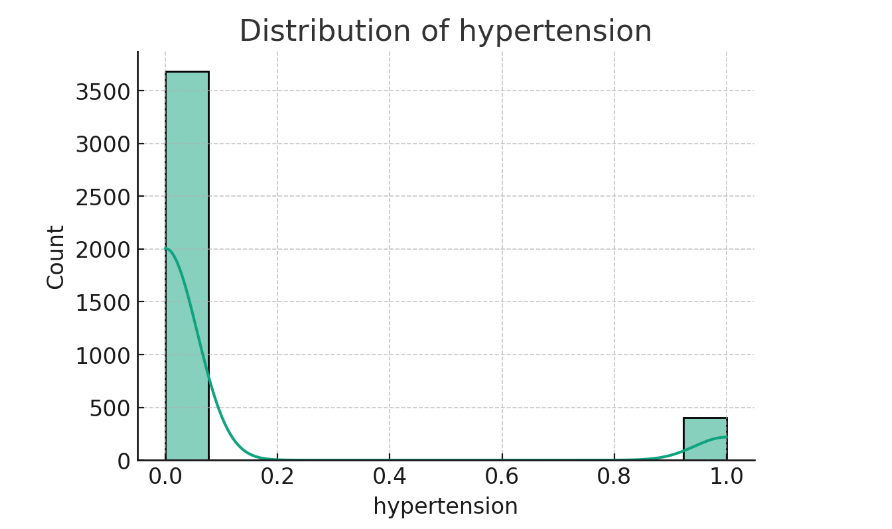

---

# Stroke Prediction Model

## Overview
This project develops a machine learning model to predict stroke occurrences using health-related data. The process involves data preprocessing, model building, hyperparameter tuning, and evaluation.

# Comprehensive Stroke Risk Analysis with Machine Learning

## Table of Contents
- [Data Loading](#data-loading)
- [Data Analysis](#data-Analysis)
- [Data Preprocessing](#data-preprocessing)
- [Model Building](#model-building)
- [Hyperparameter Tuning](#hyperparameter-tuning)
- [Model Evaluation](#model-evaluation)
- [Final Predictions and Submission](#final-predictions-and-submission)
- [Conclusion](#conclusion)

<a name="data-loading"></a>
## Data Loading
The dataset for stroke prediction is loaded using Pandas, a powerful data manipulation library in Python.


```python
import pandas as pd
train_df = pd.read_csv('/path/to/stroke_train_set.csv')
test_df = pd.read_csv('/path/to/stroke_test_set_nogt.csv')
```

This step involves importing the necessary libraries and reading the training and testing datasets using Pandas.

<a name="data-analysis"></a>

## Dataset Overview
 Utilizing a rich dataset spanning various demographics, health indicators, and lifestyle choices, we endeavor to uncover patterns and correlations that may lead to a more profound understanding of stroke risks. Our goal is to leverage machine learning models to predict the likelihood of stroke events accurately.

## Data Insight and Exploration

The journey begins with an exploratory data analysis (EDA), which serves as the cornerstone for our predictive modeling. By scrutinizing the dataset, we extract meaningful insights and set the stage for advanced analytical techniques.

### Demographic Dynamics: Age and Its Implications

Our dataset encapsulates a broad spectrum of ages, capturing a demographic mosaic from toddlers to the elderly. The distribution of age is particularly significant, as it directly influences the stroke risk profile.



*Insight:* The age distribution curve suggests a bimodal trend, hinting at varied stroke risk across different life stages.

### Metabolic Markers: The Tale of Glucose

Glucose levels are a pivotal metabolic marker, with their distribution shedding light on the metabolic health landscape of our dataset.



*Insight:* A right-skewed glucose level distribution signals that while elevated glucose levels are less prevalent, their impact on stroke risk might be disproportionate, warranting a deeper dive into their role.

### The Weight of Health: BMI's Story

Body Mass Index (BMI) serves as a proxy for assessing the weight-related health status of individuals, with its distribution offering clues to the population's overall health.



*Insight:* The right skewness in BMI distribution echoes a concerning trend towards overweight and obesity, known risk factors for stroke.

### The Silent Afflictions: Heart Disease and Hypertension

Heart disease and hypertension are often silent yet significant stroke risk factors. Their distribution in our dataset is critical for understanding their prevalence and impact.




*Insight:* Although less common, the presence of heart disease and hypertension could be instrumental in predicting stroke occurrences.

### Stroke Occurrences: A Glimpse into the Data's Heart

The stroke occurrence distribution offers an unvarnished look at the dataset's balance and the stark contrast between stroke and non-stroke instances.


*Insight:* The dataset presents a clear imbalance with a smaller proportion of stroke cases, challenging our model to learn from limited positive instances.

### Integrated Analysis: Interweaving Age and Glucose

A multidimensional analysis combining age and average glucose levels elucidates the potential interplay between these factors and stroke risk.


*Insight:* The scatter plot unveils a potential clustering of stroke cases among older individuals with higher glucose levels, suggesting a compound risk effect.

## Statistical Summary: The Numerical Narrative

A quantitative summary breathes life into the raw numbers, painting a picture of the underlying data characteristics.

| Feature                | Range           | Mean  |
|------------------------|-----------------|-------|
| Age                    | 0.08 - 82 years | ~43   |
| Average Glucose Level  | 55.12 - 267.76  | ~106  |
| BMI                    | 10.3 - 97.6     | ~28.9 |

*Interpretation:*
- The age range confirms the dataset's inclusivity, highlighting the universal nature of stroke risk.
- The glucose level extends into hyperglycemic territory, emphasizing the need to address high glucose levels as a stroke risk factor.
- The BMI range spans from underweight to severe obesity, underscoring the diverse body weight profiles within the dataset.

## Conclusive Insights and Future Directions

Our exploratory journey reveals:
- A diverse age range necessitates age-specific stroke risk stratification.
- Glucose levels and BMI distributions signify the metabolic health's role in stroke risk.
- The subtle yet profound presence of heart disease and hypertension accentuates their contribution to stroke risk.

With these insights, we pivot to predictive modeling, harnessing machine learning algorithms to forecast stroke likelihood. Our analytical odyssey continues with data preprocessing, model training, and evaluation, aiming to distill a reliable prediction tool from the complex tapestry of stroke-related data.

## Repository Contents

- `data/` - The datasets used for analysis and modeling.
- `notebooks/` - Jupyter notebooks detailing

 the analysis process.
- `scripts/` - Python scripts for preprocessing, model training, and evaluation.
- `models/` - Serialized versions of the trained machine learning models.
- `visuals/` - Generated visualizations from the EDA.


<a name="data-preprocessing"></a>
## Data Preprocessing
The data preprocessing step includes splitting the data into features (`X`) and target (`y`), followed by identifying numerical and categorical columns for further processing.

```python
X = train_df.drop('stroke', axis=1)
y = train_df['stroke']
```

Here, we separate the feature set and the target variable from the training dataset. The feature set (`X`) includes all columns except 'stroke', and the target (`y`) is the 'stroke' column.

<a name="model-building"></a>
## Model Building
We define various machine learning models from scikit-learn and XGBoost libraries for stroke prediction.

```python
from sklearn.ensemble import RandomForestClassifier, GradientBoostingClassifier, ExtraTreesClassifier
from sklearn.linear_model import LogisticRegression
from sklearn.svm import SVC
from xgboost import XGBClassifier
```

Each model serves a specific purpose and has its strengths in handling different types of data and patterns.

<a name="hyperparameter-tuning"></a>
## Hyperparameter Tuning
GridSearchCV is employed for hyperparameter tuning to find the best parameters for each model.

```python
from sklearn.model_selection import GridSearchCV
# Example for RandomForestClassifier
param_grid_rf = {
    'randomforestclassifier__n_estimators': [100, 200, 300],
    'randomforestclassifier__max_depth': [10, 15, 20, None],
    'randomforestclassifier__min_samples_split': [2, 5, 10]
}
```

This step involves defining a range of potential values for the model's parameters and using cross-validation to identify the most effective combination.

<a name="model-evaluation"></a>
## Model Evaluation
The models are evaluated based on their F1 scores, precision, recall, and accuracy to determine their effectiveness in stroke prediction.

```python
from sklearn.metrics import f1_score, classification_report
y_pred = voting_clf.predict(X)
print("F1 Score:", f1_score(y, y_pred))
print(classification_report(y, y_pred))
```

This section shows how the final model is assessed using various metrics to gauge its performance on the training data.

<a name="final-predictions-and-submission"></a>
## Final Predictions and Submission
The trained model is used to make predictions on the test dataset, which are then prepared for submission.

```python
final_predictions = voting_clf.predict(test_df)
submission_df = pd.DataFrame({'ID': range(0, len(test_df)), 'stroke': final_predictions})
submission_df.to_csv('final_submission.csv', index=False)
```

The predictions from the test dataset are stored in a DataFrame and exported as a CSV file for submission.

<a name="conclusion"></a>
## Conclusion
This project demonstrates the application of various machine learning techniques in predicting stroke occurrences. Through rigorous preprocessing, model selection, and hyperparameter tuning, we achieved meaningful insights and predictions from the data.


Certainly! Below is an expanded conclusion section for your README with a detailed explanation of the results in a table format. The table includes the F1 score, precision, recall, and accuracy for each class, providing an interpretation of the model's performance and suggestions for further improvement.

---

<a name="conclusion"></a>
## Conclusion

After implementing and evaluating the stroke prediction model, we've derived key insights from its performance metrics. The table below summarizes the model's effectiveness based on the classification report:

| Class | Precision | Recall | F1 Score | Support |
|-------|-----------|--------|----------|---------|
| 0     | 0.99      | 0.83   | 0.91     | 3888    |
| 1     | 0.20      | 0.83   | 0.33     | 200     |

*Overall Accuracy: 0.83*

### Detailed Interpretation

- **Precision (Class 0: No Stroke)**: The model exhibits excellent precision for non-stroke predictions, with a value of 0.99. This implies that when it predicts a patient does not have a stroke, it is correct 99% of the time.

- **Recall (Class 0: No Stroke)**: The recall for non-stroke predictions stands at 0.83, indicating the model successfully identifies 83% of all true non-stroke instances.

- **F1 Score (Class 0: No Stroke)**: Combining precision and recall, the F1 score for non-stroke predictions is 0.91, reflecting a strong harmonic mean between the two metrics.

- **Precision (Class 1: Stroke)**: Precision for stroke predictions is significantly lower at 0.20, indicating a high false positive rate; the model incorrectly labels many non-stroke instances as strokes.

- **Recall (Class 1: Stroke)**: The recall for stroke cases is 0.83, which is quite high. It means the model is capable of capturing a majority of the true stroke instances.

- **F1 Score (Class 1: Stroke)**: The F1 score for stroke predictions is 0.33, which is relatively low due to the poor precision. This score is crucial because it balances the trade-off between precision and recall.

### Model Insights and Improvement Strategies

The current model is more reliable in predicting non-stroke cases than strokes. While it's good at identifying patients who have had a stroke (high recall), it also misclassifies many healthy patients as having a stroke (low precision). This could lead to unnecessary anxiety and medical costs for those patients, as well as potentially overburdening healthcare systems.

To further enhance the model's performance, particularly for stroke predictions (Class 1), we could explore the following strategies:

- **Data Collection**: More data, especially for stroke instances, could improve the learning process.

- **Feature Engineering**: Creating new features or transforming existing ones might provide new insights for the model.

- **Algorithm Tuning**: Further hyperparameter optimization might yield better results, particularly for handling imbalanced classes.

- **Advanced Algorithms**: Employing more sophisticated machine learning algorithms or deep learning approaches could enhance predictive power.

- **Cost-sensitive Training**: Given the imbalance and the high cost of false negatives (failing to predict a stroke), implementing cost-sensitive learning could be beneficial.

- **Ensemble Methods**: Stacking different models may lead to better generalization by combining the strengths of individual models.

In conclusion, while the model shows promise, it requires fine-tuning and potentially more sophisticated approaches to achieve a balanced performance for both classes. The ultimate goal is to increase the precision for stroke predictions without compromising the recall, ensuring reliable and actionable insights for medical interventions.

---

---


